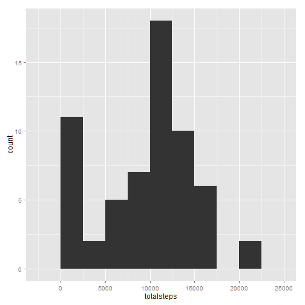
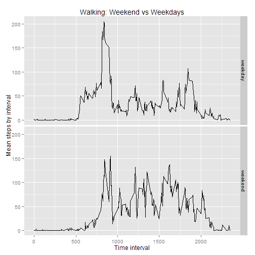

---
output:
  html_document:
    theme: cerulean
---

## Reproducible Research: Peer Assessment 1
This assignment makes use of data from a personal activity monitoring
device. This device collects data at 5 minute intervals through out the
day. The data consists of two months of data from an anonymous
individual collected during the months of October and November, 2012
and include the number of steps taken in 5 minute intervals each day.

## Loading and preprocessing the data

### Question

Show any code that is needed to

1. Load the data (i.e. `read.csv()`)

2. Process/transform the data (if necessary) into a format suitable for your analysis

###Results


```r
require(lubridate)
```

```
## Loading required package: lubridate
```

```r
require(ggplot2)
```

```
## Loading required package: ggplot2
```

```r
require(plyr)
```

```
## Loading required package: plyr
## 
## Attaching package: 'plyr'
## 
## The following object is masked from 'package:lubridate':
## 
##     here
```

```r
if (!file.exists("activity.csv")) unzip("activity.zip")

act <- read.csv("activity.csv")
act$date <- ymd(act$date)
```


## What is mean total number of steps taken per day?

###Question

For this part of the assignment, you can ignore the missing values in
the dataset.

1. Make a histogram of the total number of steps taken each day

2. Calculate and report the **mean** and **median** total number of steps taken per day

###Results


```r
# Use ddply from plyr to total steps by date.
actsummary <- ddply(act, .(date), summarize, totalsteps = sum(steps))
# Plot histogram
qplot(totalsteps, data = actsummary)
```

```
## stat_bin: binwidth defaulted to range/30. Use 'binwidth = x' to adjust this.
```

 

```r
# Calculate mean and median
mean(actsummary$totalsteps, na.rm = TRUE)
```

```
## [1] 10766
```

```r
median(actsummary$totalsteps, na.rm = TRUE)
```

```
## [1] 10765
```

## What is the average daily activity pattern?

###Question

1. Make a time series plot (i.e. `type = "l"`) of the 5-minute interval (x-axis) and the average number of steps taken, averaged across all days (y-axis)

2. Which 5-minute interval, on average across all the days in the dataset, contains the maximum number of steps?

###Results


```r
actstepsummary <- ddply(act, .(interval), summarize, meansteps = mean(steps, 
    na.rm = TRUE), mediansteps = median(steps, na.rm = TRUE))
qplot(interval, meansteps, geom = "line", data = actstepsummary)
```

 

```r
# peak activity interval
actstepsummary$interval[which.max(actstepsummary$meansteps)]
```

```
## [1] 835
```

## Imputing missing values

###Question

Note that there are a number of days/intervals where there are missing
values (coded as `NA`). The presence of missing days may introduce
bias into some calculations or summaries of the data.

1. Calculate and report the total number of missing values in the dataset (i.e. the total number of rows with `NA`s)

2. Devise a strategy for filling in all of the missing values in the dataset. The strategy does not need to be sophisticated. For example, you could use the mean/median for that day, or the mean for that 5-minute interval, etc.

3. Create a new dataset that is equal to the original dataset but with the missing data filled in.

4. Make a histogram of the total number of steps taken each day and Calculate and report the **mean** and **median** total number of steps taken per day. Do these values differ from the estimates from the first part of the assignment? What is the impact of imputing missing data on the estimates of the total daily number of steps?

###Results


```r
# How many missing values?
sum(is.na(act$steps))
```

```
## [1] 2304
```

```r
actimp <- join(act, actstepsummary)  #brings the mean and median steps into the data frame
```

```
## Joining by: interval
```

```r
# Replace all NA values on steps with median steps for the interval
actimp$steps[is.na(actimp$steps)] <- actimp$mediansteps[is.na(actimp$steps)]
actimp$meansteps <- NULL  #removes mean
actimp$mediansteps <- NULL  #removes median 
actimpdatesummary <- ddply(actimp, .(date), summarize, totalsteps = sum(steps))
qplot(totalsteps, data = actimpdatesummary)
```

```
## stat_bin: binwidth defaulted to range/30. Use 'binwidth = x' to adjust this.
```

 


The missing values in intervals where data was not available were replaced by the median steps for the interval. THe biggest difference between the histograms with and without imputed missing values is that there is another large peak to the distribution at the lower end of the distribution, closer to zero steps. This may be illustrated by looking at the new means and medians for the distribution. 

```r
# Calculate new mean and median
mean(actimpdatesummary$totalsteps, na.rm = TRUE)
```

```
## [1] 9504
```

```r
median(actimpdatesummary$totalsteps, na.rm = TRUE)
```

```
## [1] 10395
```

The mean steps has reduced by more than a 1000 due to the replacement of many NA values by median values, which are 0 in many cases. As expected, this does not change the median of the data much. 

##Are there differences in activity patterns between weekdays and weekends?##

###Question

For this part the `weekdays()` function may be of some help here. Use
the dataset with the filled-in missing values for this part.

1. Create a new factor variable in the dataset with two levels -- "weekday" and "weekend" indicating whether a given date is a weekday or weekend day.

2. Make a panel plot containing a time series plot (i.e. `type = "l"`) of the 5-minute interval (x-axis) and the average number of steps taken, averaged across all weekday days or weekend days (y-axis).

###Results


```r
# Add weekend/weekday designation to the dates using wday from lubridate as
# alternative for weekdays()
weekendcheck <- wday(actimp$date) == 1 | wday(actimp$date) == 7
actimp$daytype[weekendcheck] <- "weekend"
actimp$daytype[!weekendcheck] <- "weekday"
actimp$daytype <- as.factor(actimp$daytype)
# Summarize by both day type and interval
actdaytypesummary <- ddply(actimp, .(daytype, interval), summarize, meansteps = mean(steps))
qplot(interval, meansteps, data = actdaytypesummary, facets = daytype ~ ., geom = "line", 
    ylab = "Mean steps by interval", xlab = "Time interval", main = "Walking: Weekend vs Weekdays")
```

 

```r

qplot(interval, meansteps, data = actdaytypesummary, colour = daytype, geom = "line", 
    ylab = "Mean steps by interval", xlab = "Time interval", main = "Walking: Weekend vs Weekdays")
```

 

Some clear differences pop up. Firstly, the subject wakes up earlier on weekdays, and there is more activity in the morning leading up to the clear peak at around 8:30 (presumably the start/culmination of the morning work commute). Weekend wake times are later, and the activity pattern is more diffuse, with a bit more activity in the evening.The figure with the activities overlaid and separated by colour illustrates this a bit better.
